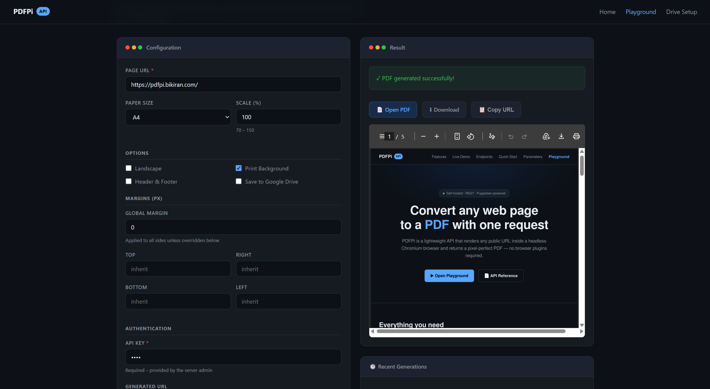

# PDFPi – Web & Markdown to PDF API

A self-hosted REST API that converts any public web page **or** a Markdown
document into a PDF file using a headless Chromium browser (Puppeteer).



---

## Table of Contents

1. [Overview](#overview)
2. [Architecture](#architecture)
3. [Prerequisites](#prerequisites)
4. [Getting Started](#getting-started)
   - [Development](#development)
   - [Production build](#production-build)
   - [Docker](#docker)
5. [API Reference](#api-reference)
   - [Web → PDF](#get-pdfgenerate)
   - [Markdown → PDF](#post-markdowngenerate)
   - [Static file downloads](#get-downloadsfilename)
6. [Query-parameter reference (Web → PDF)](#query-parameter-reference)
7. [Body-field reference (Markdown → PDF)](#body-field-reference-markdown--pdf)
8. [Environment variables](#environment-variables)
9. [Project structure](#project-structure)
10. [Security](#security)
11. [Known limitations](#known-limitations)
12. [Google Drive Setup](#google-drive-setup)
13. [License](#license)

---

## Overview

**PDFPi** accepts a URL via a simple HTTP `GET` request,
renders the page inside a headless Chrome instance, and returns the path to
the generated PDF. PDFs are stored in a `downloads/` directory at the
project root and served as static files on the `/downloads` path.

PDFPi also accepts **raw Markdown** via a `POST` request. The server converts
the Markdown to a clean, styled HTML document, sanitizes it (removing scripts
and unsafe attributes), and renders it to PDF — no URL required.

Additional features:

- **Static file serving** – generated PDFs are served on the `/downloads`
  path.
- **Google Drive upload** – optionally save PDFs to a Shared Drive folder
  via a built-in Setup UI or environment variables.
- **SSRF protection** – internal/private IPs are blocked at the validation
  layer for the web → PDF endpoint.
- **Markdown sanitization** – the Markdown → PDF pipeline sanitizes HTML
  output to strip scripts, event handlers, and unsafe URIs before rendering.

---

## Architecture

```
                    ┌───────────────────────────────────────────────┐
                    │              Express HTTP Server               │
                    │            (port from PORT env var)            │
                    │                                                │
 Client ──HTTP──▶  │  GET  /pdf/generate          → pdf.route       │
                    │  POST /markdown/generate     → markdown.route  │
                    │  GET  /downloads/:file       → express.static  │
                    └────────────────┬──────────────────────────────┘
                                     │
                                     ▼
                           ┌─────────────────┐
                           │  BrowserManager  │
                           │  (Puppeteer /    │
                           │   Chromium)      │
                           └─────────────────┘
                                     │ generates
                                     ▼
                           downloads/<title>.pdf
```

### Key modules

| Path                                                    | Responsibility                                 |
| ------------------------------------------------------- | ---------------------------------------------- |
| `src/index.ts`                                          | Express + HTTP server bootstrap                |
| `src/config.ts`                                         | Centralised environment configuration          |
| `src/middleware/apiKeyAuth.ts`                          | API key authentication guard                   |
| `src/modules/browser/browserManager.ts`                 | Singleton Puppeteer browser; session lifecycle |
| `src/modules/pdf/generatePdf.validation.ts`             | Query-string validation & normalisation        |
| `src/modules/markdown/markdownToHtml.ts`                | Markdown → sanitized, styled HTML conversion   |
| `src/modules/markdown/generateMarkdownPdf.validation.ts`| Request-body validation for Markdown → PDF     |
| `src/modules/drive/googleDriveManager.ts`               | Google Drive upload via Service Account        |
| `src/modules/drive/driveConfigManager.ts`               | File-based Drive config persistence            |
| `src/routes/setup.route.ts`                             | `POST /api/setup/drive` setup endpoints        |
| `src/utils/downloadDir.ts`                              | Resolves & ensures the `downloads/` directory  |
| `src/routes/pdf.route.ts`                               | `GET /pdf/generate` handler                    |
| `src/routes/markdown.route.ts`                          | `POST /markdown/generate` handler              |
| `src/middleware/globalErrorHandler.ts`                  | Catches unhandled errors; returns JSON         |
| `src/middleware/notFound.ts`                            | Returns 404 JSON for unknown routes            |
| `src/types/index.ts`                                    | Shared TypeScript types                        |

---

## Prerequisites

| Tool              | Version                              |
| ----------------- | ------------------------------------ |
| Node.js           | ≥ 20                                 |
| Yarn              | ≥ 1.22                               |
| Chromium / Chrome | installed automatically by Puppeteer |

---

## Getting Started

### Development

```bash
# 1. Install dependencies
yarn install

# 2. Copy the example env file
cp .env.example .env

# 3. (First time) Download the Puppeteer-managed Chromium browser
npx puppeteer browsers install chrome

# 4. Start the dev server with hot-reload
yarn dev
# → http://localhost:7301
```

### Production build

```bash
yarn build   # compiles TypeScript → dist/
yarn start   # runs node dist/index.js
```

### Docker

```bash
# Build image
docker build -t pdfpi .

# Run container (maps port 7301)
docker run -d -p 7301:7301 pdfpi

# With API key authentication
docker run -d -p 7301:7301 -e API_KEY=your-secret-key pdfpi
```

The `Dockerfile` uses a two-stage build on **Node 24 LTS Alpine**:

1. **Build stage** – installs dependencies and compiles TypeScript
   (Puppeteer's bundled Chromium download is skipped).
2. **Runtime stage** – installs system Chromium via `apk`, copies
   `dist/` and `node_modules/` into a minimal Alpine image.

---

## API Reference

### `GET /pdf/generate`

Converts a web page to a PDF and saves it to `downloads/`.

**Query parameters** – see the full [query-parameter reference](#query-parameter-reference) below.

**Success response** `200 OK`

```json
{
  "error": false,
  "message": "PDF generated successfully",
  "pdfUrl": "/downloads/MyPage-1712345678.pdf"
}
```

When `save=true` and Google Drive is configured, the response includes:

```json
{
  "error": false,
  "message": "PDF generated successfully",
  "pdfUrl": "/downloads/MyPage-1712345678.pdf",
  "drive": {
    "id": "1aBcDeFg...",
    "name": "MyPage-1712345678.pdf",
    "viewUrl": "https://drive.google.com/file/d/.../view",
    "downloadUrl": "https://drive.google.com/uc?id=...&export=download"
  }
}
```

**Error response** `400 Bad Request` (validation failure)

```json
{
  "error": true,
  "message": {
    "url": "url is required and must be a string"
  }
}
```

**Error response** `500 Internal Server Error`

```json
{
  "error": true,
  "message": "Failed to generate PDF. <details>"
}
```

---

### `POST /markdown/generate`

Converts a Markdown document to a PDF and saves it to `downloads/`.

**Request body (JSON)** – see the full [body-field reference](#body-field-reference-markdown--pdf) below.

**Success response** `200 OK`

```json
{
  "error": false,
  "message": "PDF generated successfully",
  "pdfUrl": "/downloads/My-Report-1712345678.pdf"
}
```

The optional `drive` object is included when `save: true` and Google Drive is configured (same shape as the web → PDF response above).

**Error response** `400 Bad Request` (validation failure)

```json
{
  "error": true,
  "message": {
    "markdown": "markdown is required and must be a string"
  }
}
```

**Example cURL**

```bash
curl -X POST http://localhost:7301/markdown/generate \
     -H "Content-Type: application/json" \
     -d '{
       "markdown": "# Hello World\n\nThis is **bold** and *italic* text.",
       "title": "My-Report",
       "size": "A4",
       "marginTop": 40,
       "marginRight": 48,
       "marginBottom": 40,
       "marginLeft": 48
     }'
```

---

### `GET /downloads/:filename`

Serves generated PDF files as static assets.

```
GET /downloads/MyPage-1712345678.pdf
```

---

## Query-parameter reference

All parameters are passed as URL query strings to `GET /pdf/generate`.

| Parameter           | Type                        | Default      | Description                                                                    |
| ------------------- | --------------------------- | ------------ | ------------------------------------------------------------------------------ |
| `url`               | `string`                    | **required** | Full URL of the web page to convert                                            |
| `id`                | `string`                    | **required** | Unique session identifier                                                      |
| `size`              | `A3\|A4\|A5\|Legal\|Letter` | `A4`         | Paper format                                                                   |
| `landscape`         | `"true"\|"false"`           | `false`      | Landscape orientation                                                          |
| `scale`             | `number` (70–150)           | `100`        | Rendering scale percentage                                                     |
| `printBackground`   | `"true"\|"false"`           | `true`       | Include CSS backgrounds                                                        |
| `printHeaderFooter` | `"true"\|"false"`           | `false`      | Show date/URL header and page-number footer                                    |
| `margin`            | `number` ≥ 0                | `0`          | Global margin (px) applied to all sides                                        |
| `marginTop`         | `number` ≥ 0                | `margin`     | Top margin override (px)                                                       |
| `marginRight`       | `number` ≥ 0                | `margin`     | Right margin override (px)                                                     |
| `marginBottom`      | `number` ≥ 0                | `margin`     | Bottom margin override (px)                                                    |
| `marginLeft`        | `number` ≥ 0                | `margin`     | Left margin override (px)                                                      |
| `save`              | `"true"\|"false"`           | `false`      | Upload the PDF to Google Drive (see [setup guide](docs/GOOGLE_DRIVE_SETUP.md)) |
| `autoPrint`         | `"true"\|"false"`           | `false`      | _(reserved)_ Auto-print trigger                                                |
| `adjustSinglePage`  | `"true"\|"false"`           | `false`      | _(reserved)_ Single-page fit                                                   |

**Example**

```
GET /pdf/generate?url=https://example.com&id=sess-001&size=A4&landscape=false&scale=100&printBackground=true&margin=10
```

**With Google Drive upload:**

```
GET /pdf/generate?url=https://example.com&id=sess-001&size=A4&save=true
```

---

## Body-field reference (Markdown → PDF)

All fields are sent as a JSON body to `POST /markdown/generate`.

| Field               | Type                        | Default        | Description                                                                    |
| ------------------- | --------------------------- | -------------- | ------------------------------------------------------------------------------ |
| `markdown`          | `string`                    | **required**   | Raw Markdown text. Maximum 500 KB.                                             |
| `title`             | `string`                    | `"Document"`   | PDF filename (without extension) and `<title>` tag value.                      |
| `size`              | `A3\|A4\|A5\|Legal\|Letter` | `A4`           | Paper format                                                                   |
| `landscape`         | `boolean`                   | `false`        | Landscape orientation                                                          |
| `scale`             | `number` (70–150)           | `100`          | Rendering scale percentage                                                     |
| `printBackground`   | `boolean`                   | `true`         | Include CSS backgrounds                                                        |
| `printHeaderFooter` | `boolean`                   | `false`        | Show title header and page-number footer                                       |
| `margin`            | `number` ≥ 0                | `0`            | Global margin (px) applied to all sides                                        |
| `marginTop`         | `number` ≥ 0                | `margin`       | Top margin override (px)                                                       |
| `marginRight`       | `number` ≥ 0                | `margin`       | Right margin override (px)                                                     |
| `marginBottom`      | `number` ≥ 0                | `margin`       | Bottom margin override (px)                                                    |
| `marginLeft`        | `number` ≥ 0                | `margin`       | Left margin override (px)                                                      |
| `save`              | `boolean`                   | `false`        | Upload the PDF to Google Drive (see [setup guide](docs/GOOGLE_DRIVE_SETUP.md)) |

---

## Environment variables

Copy `.env.example` to `.env` and adjust:

```bash
cp .env.example .env
```

| Variable                          | Default             | Description                                                                           |
| --------------------------------- | ------------------- | ------------------------------------------------------------------------------------- |
| `NODE_ENV`                        | `production`        | Set to `development` to include error stack traces in API responses                   |
| `PORT`                            | `7301`              | Port the HTTP server listens on                                                       |
| `HOST`                            | `0.0.0.0`           | Network interface to bind to                                                          |
| `API_KEY`                         | _(empty)_           | API key for authentication. Leave empty to disable auth (open access)                 |
| `CORS_ORIGINS`                    | `*`                 | Comma-separated allowed origins, or `*` for all                                       |
| `RATE_LIMIT_MAX`                  | `20`                | Max requests per IP per window                                                        |
| `RATE_LIMIT_WINDOW_MIN`           | `1`                 | Rate-limit window duration in minutes                                                 |
| `VIEWPORT_WIDTH`                  | `1920`              | Puppeteer viewport width (px)                                                         |
| `VIEWPORT_HEIGHT`                 | `2080`              | Puppeteer viewport height (px)                                                        |
| `PAGE_LOAD_TIMEOUT`               | `30000`             | Max time (ms) to wait for page navigation                                             |
| `PAGE_CREATE_TIMEOUT`             | `10000`             | Max time (ms) to wait for new browser tab creation                                    |
| `POST_LOAD_DELAY`                 | `2000`              | Delay (ms) after page load before PDF generation                                      |
| `HEADLESS`                        | `true`              | Run Puppeteer in headless mode                                                        |
| `PUPPETEER_EXECUTABLE_PATH`       | _(empty)_           | Custom Chromium path (set automatically in Docker Alpine)                             |
| `JSON_BODY_LIMIT`                 | `10mb`              | Max JSON request body size                                                            |
| `CONFIG_DIR`                      | `/home/node/.pdfpi` | Directory for persisted config files (Drive setup). Automatically created at runtime. |
| `GOOGLE_SERVICE_ACCOUNT_KEY_PATH` | _(empty)_           | Path to a Google Service Account JSON key file (fallback; prefer Setup UI)            |
| `GOOGLE_DRIVE_FOLDER_ID`          | _(empty)_           | Target Google Drive folder ID for PDF uploads (fallback; prefer Setup UI)             |

### Authentication

When `API_KEY` is set, all `/pdf/*` endpoints require a valid key via:

- **Header**: `x-api-key: <your-key>`
- **Query param**: `?apiKey=<your-key>`

The UI pages (landing page & playground) automatically detect whether auth
is enabled and will prompt for the API key when needed.

---

## Project structure

```
.
├── .env.example                      # Environment variable template
├── Dockerfile                        # Two-stage Docker build
├── package.json
├── tsconfig.json
├── docs/
│   └── GOOGLE_DRIVE_SETUP.md         # Google Drive manual setup guide
├── downloads/                        # Generated PDFs (git-ignored)
├── public/
│   ├── index.html                    # Landing page
│   ├── playground.html               # Web → PDF playground
│   ├── markdown-playground.html      # Markdown → PDF playground
│   └── setup-drive.html              # Google Drive setup wizard (locked after setup)
└── src/
    ├── index.ts                      # Application entry point
    ├── config.ts                     # Centralised env-based configuration
    ├── middleware/
    │   ├── apiKeyAuth.ts             # API key authentication middleware
    │   ├── globalErrorHandler.ts
    │   └── notFound.ts
    ├── modules/
    │   ├── browser/
    │   │   └── browserManager.ts     # Puppeteer singleton
    │   ├── drive/
    │   │   ├── driveConfigManager.ts  # File-based Drive config read/write
    │   │   └── googleDriveManager.ts  # Google Drive upload helper
    │   ├── markdown/
    │   │   ├── markdownToHtml.ts      # Markdown → sanitized HTML conversion
    │   │   └── generateMarkdownPdf.validation.ts  # Body validation
    │   └── pdf/
    │       └── generatePdf.validation.ts
    ├── routes/
    │   ├── pdf.route.ts
    │   ├── markdown.route.ts          # POST /markdown/generate
    │   └── setup.route.ts            # Drive setup API (auto-locks)
    ├── types/
    │   └── index.ts
    └── utils/
        ├── downloadDir.ts
        └── publicDir.ts
```

---

## Security

The API ships with multiple security layers that can be activated via
environment variables:

| Feature                        | How to enable                                                                   |
| ------------------------------ | ------------------------------------------------------------------------------- |
| **API key auth**               | Set `API_KEY` env var                                                           |
| **Rate limiting**              | Enabled by default (`RATE_LIMIT_MAX`, `RATE_LIMIT_WINDOW_MIN`)                  |
| **CORS restrictions**          | Set `CORS_ORIGINS` to specific origins                                          |
| **Helmet HTTP headers**        | Always on (CSP, HSTS, X-Frame-Options, etc.)                                    |
| **SSRF protection**            | Always on — blocks `localhost`, private IPs, link-local ranges (web → PDF only) |
| **Markdown HTML sanitization** | Always on — strips `<script>`, event handlers, and unsafe URIs via sanitize-html |

---

## Known limitations

- **Single browser process** – all PDF requests share one Puppeteer
  browser instance. Under high concurrency, requests will queue behind
  each other.

---

## Google Drive Setup

There are two ways to configure Google Drive uploads:

### Option A – Setup UI (recommended)

Open `/setup-drive.html` in your browser. The wizard walks you through
creating a service account, sharing a Drive folder, and saving the
configuration. The config is persisted to `CONFIG_DIR` (default
`/home/node/.pdfpi/drive-config.json`). **After saving, the setup page
is permanently locked for public access.**

### Option B – Environment variables

Set `GOOGLE_SERVICE_ACCOUNT_KEY_PATH` and `GOOGLE_DRIVE_FOLDER_ID` in
your `.env` file. See the [manual guide](docs/GOOGLE_DRIVE_SETUP.md)
for step-by-step instructions.

The Setup UI config takes priority over environment variables.

---

## 📄 License

MIT License - see the [LICENSE](https://github.com/bikirandev/pdfpi/blob/master/LICENSE) file for details.

## 👨‍💻 Author

**Developed by [Bikiran](https://bikiran.com/)**

- 🌐 Website: [bikiran.com](https://bikiran.com/)
- 📧 Email: [Contact](https://bikiran.com/contact)
- 🐙 GitHub: [@bikirandev](https://github.com/bikirandev)

---

<div align="center">

**Made with ❤️ for the React community**

[⭐ Star this repo](https://github.com/bikirandev/pdfpi) • [🐛 Report Bug](https://github.com/bikirandev/pdfpi/issues) • [💡 Request Feature](https://github.com/bikirandev/pdfpi/issues/new)

</div>

---

## 🏢 About Bikiran

**[Bikiran](https://bikiran.com/)** is a software development and cloud infrastructure company founded in 2012, headquartered in Khulna, Bangladesh. With 15,000+ clients and over a decade of experience, Bikiran builds and operates a suite of products spanning domain services, cloud hosting, app deployment, workflow automation, and developer tools.

| SL  | Topic        | Product                                                              | Description                                             |
| --- | ------------ | -------------------------------------------------------------------- | ------------------------------------------------------- |
| 1   | Website      | [Bikiran](https://bikiran.com/)                                      | Main platform — Domain, hosting & cloud services        |
| 2   | Website      | [Edusoft](https://www.edusoft.com.bd/)                               | Education management software for institutions          |
| 3   | Website      | [n8n Clouds](https://n8nclouds.com/)                                 | Managed n8n workflow automation hosting                 |
| 4   | Website      | [Timestamp Zone](https://www.timestamp.zone/)                        | Unix timestamp converter & timezone tool                |
| 5   | Website      | [PDFpi](https://pdfpi.bikiran.com/)                                  | Online PDF processing & manipulation tool               |
| 6   | Website      | [Blog](https://blog.bikiran.com/)                                    | Technical articles, guides & tutorials                  |
| 7   | Website      | [Support](https://support.bikiran.com/)                              | 24/7 customer support portal                            |
| 8   | Website      | [Probackup](https://probackup.bikiran.com/)                          | Automated database backup for SQL, PostgreSQL & MongoDB |
| 9   | Service      | [Domain](https://www.bikiran.com/domain)                             | Domain registration, transfer & DNS management          |
| 10  | Service      | [Hosting](https://www.bikiran.com/services/hosting/web)              | Web, app & email hosting on NVMe SSD                    |
| 11  | Service      | Email & SMS                                                          | Bulk email & SMS notification service                   |
| 12  | npm          | [Chronopick](https://www.npmjs.com/package/@bikiran/chronopick)      | Date & time picker React component                      |
| 13  | npm          | [Rich Editor](https://www.npmjs.com/package/@bikiran/editor)         | WYSIWYG rich text editor for React                      |
| 14  | npm          | [Button](https://www.npmjs.com/package/@bikiran/button)              | Reusable React button component library                 |
| 15  | npm          | [Electron Boilerplate](https://www.npmjs.com/package/create-edx-app) | CLI to scaffold Electron.js project templates           |
| 16  | NuGet        | [Bkash](https://www.nuget.org/packages/Bikiran.Payment.Bkash)        | bKash payment gateway integration for .NET              |
| 17  | NuGet        | [Bikiran Engine](https://www.nuget.org/packages/Bikiran.Engine)      | Core .NET engine library for Bikiran services           |
| 18  | Open Source  | [PDFpi](https://github.com/bikirandev/pdfpi)                         | PDF processing tool — open source                       |
| 29  | Open Source  | [Bikiran Engine](https://github.com/bikirandev/Bikiran.Engine)       | Core .NET engine — open source                          |
| 20  | Open Source  | [Drive CLI](https://github.com/bikirandev/DriveCLI)                  | CLI tool to manage Google Drive from terminal           |
| 21  | Docker       | [Pgsql](https://github.com/bikirandev/docker-pgsql)                  | Docker setup for PostgreSQL                             |
| 22  | Docker       | [n8n](https://github.com/bikirandev/docker-n8n)                      | Docker setup for n8n automation                         |
| 23  | Docker       | [Pgadmin](https://github.com/bikirandev/docker-pgadmin)              | Docker setup for pgAdmin                                |
| 24  | Social Media | [LinkedIn](https://www.linkedin.com/company/bikiran12)               | Bikiran on LinkedIn                                     |
| 25  | Social Media | [Facebook](https://www.facebook.com/bikiran12)                       | Bikiran on Facebook                                     |
| 26  | Social Media | [YouTube](https://www.youtube.com/@bikiranofficial)                  | Bikiran on YouTube                                      |
| 27  | Social Media | [FB n8nClouds](https://www.facebook.com/n8nclouds)                   | n8n Clouds on Facebook                                  |

